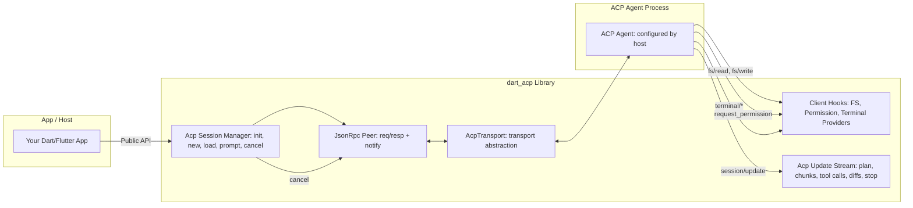
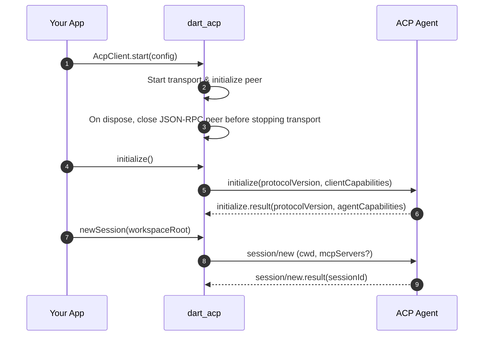
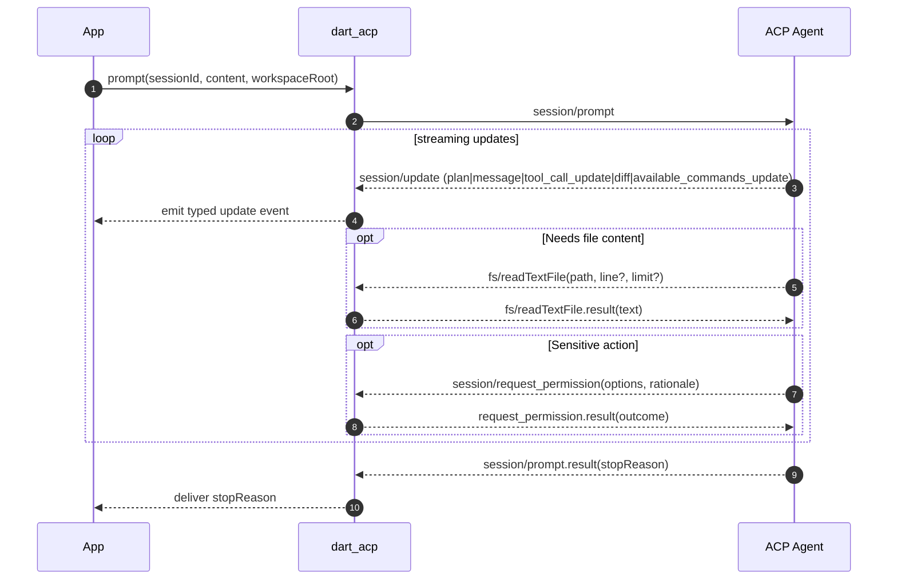
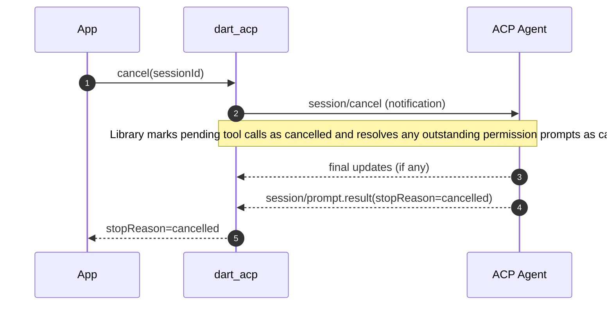
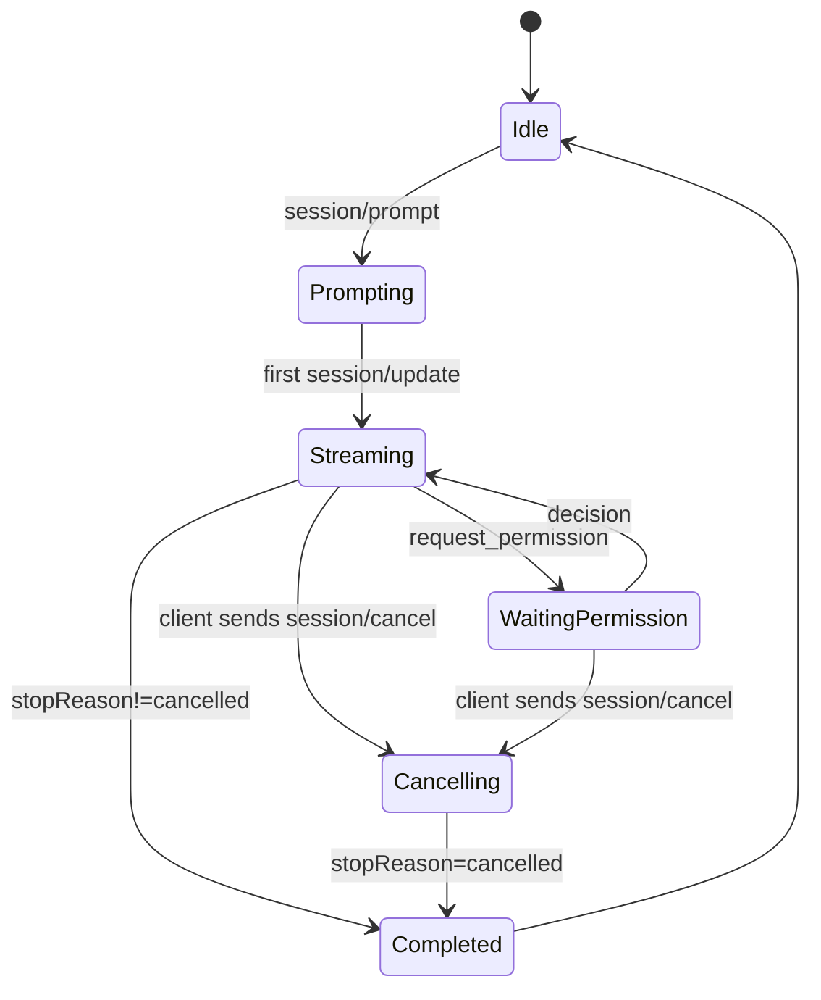

# `dart_acp` Technical Design (Client-Side for ACP)

Client library that lets Dart/Flutter apps connect to ACP agents over a bidirectional stream. This document covers the design of both the `dart_acp` library and the separate example CLI located under `example/`.

ACP Specification: https://agentclientprotocol.com/overview/introduction

---

## 1. Summary

`dart_acp` is a Dart client for the **Agent Client Protocol (ACP)** (JSON‑RPC 2.0 over a bidirectional stream). It provides:

- A high‑level client façade for **initialize → session/new|session/load → session/prompt → session/cancel**.
- A **stream of updates** (plan changes, assistant message chunks, tool calls, diffs, available commands, etc.).
- **Agent→Client callbacks** for file system reads/writes, permission prompts, and terminal lifecycle.
- **Transport abstraction** (transport‑agnostic; supports stdio; TCP/WebSocket also possible).
\- **CLI settings**: the example CLI resolves agent command/args and environment overlay from a `settings.json` file located next to the CLI (script directory).

This library enables Dart apps—and `dartantic_ai` via a small adapter—to talk to ACP agents configured by the host.

### 1.1 Library vs CLI

- **Library (`dart_acp`)**: A reusable client providing transports, JSON‑RPC peer, session management, providers (FS, permissions, terminal), and a typed updates stream. It is UI‑agnostic and agent‑agnostic. The library does not read `settings.json`; callers must provide `agentCommand`, `agentArgs`, and `envOverrides` explicitly. The `workspaceRoot` is specified per session, not globally.
- **Example CLI (`example/bin/acpcli/main.dart`)**: A command‑line program demonstrating the library. The CLI resolves the agent via `settings.json` located next to the CLI (script directory), starts a session in the current working directory, sends a single prompt, streams updates to stdout, and supports `--agent/-a` and `--jsonl/-j`.
- **Simple Example (`example/main.dart`)**: A minimal example showing basic library usage with hardcoded agent configuration.

---

## 2. Goals & Non‑Goals

### Goals
- Be a **strict ACP client** that is transport‑agnostic and interoperable with ACP agents over supported transports.
- Expose a **strongly‑typed events stream** of ACP `session/update` notifications.
- Provide **pluggable providers** for FS access and permission decisions.
- No credential flows in the client; environment overlay provided by the host. The example CLI reads `settings.json` next to the CLI to build env/command.

### Non‑Goals
- No storage of credentials, no OAuth UI, no secret management vaults.
- No opinionated UI for diffs/edits—only structured events that a host app can render.
- No agent‑side implementation (that could be a sibling package later).

---

## 3. Architecture Overview



**Key points**  
- **Transport** abstracts how bytes flow; first implementation spawns a subprocess and wires stdin/stdout.  
- **JsonRpc Peer** is a single bidirectional peer so the agent can issue callbacks to the client.  
- **Session Manager** encapsulates ACP method orchestration, session lifecycle, and update demux.  
- **Hooks** are app‑provided handlers used when the agent requests FS, permissions, or terminal lifecycle.  
- **Update Stream** provides a single, ordered stream the host can subscribe to.

---

## 4. Protocol Mapping (ACP → Library Responsibilities)

- **initialize**: Negotiate protocol version and capability exchange. Library exposes a simple "client capabilities" struct (e.g., `fs.readTextFile`, `fs.writeTextFile`) and records agent capabilities/methods.  
- **session/new** & **session/load**: Start a new session (specify working directory / workspace root) or load an existing one if supported by the agent. Session responses may include mode information.
- **session/prompt**: Send content blocks; stream `session/update` notifications (plan entries with priorities, assistant message deltas, tool calls with enhanced status, diffs, available command updates, mode changes, etc.); complete with a **StopReason**.  
- **session/cancel**: Notify the agent; ensure pending permission prompts are resolved as cancelled; expect a final prompt result with `stopReason=cancelled`.  
- **session/set_mode**: Switch between agent operating modes when supported (extension).
- **Agent→Client**: Handle `read_text_file`, `write_text_file`, `session/request_permission`, and terminal lifecycle (`create_terminal`, `terminal_output`, `wait_for_terminal_exit`, `kill_terminal`, `release_terminal`) via the configured providers.

### 4.1 Tool Call Update Handling

The SessionManager properly implements ACP's tool call update semantics:

- **Tool Call Tracking**: Maintains a `_toolCalls` map indexed by `[sessionId][toolCallId]` to track all tool calls
- **New Tool Calls** (`tool_call`): Creates and stores a new `ToolCall` object in the tracking map
- **Tool Call Updates** (`tool_call_update`): Merges update fields into the existing tool call using `ToolCall.merge()`
- **Merge Semantics**: Only non-null fields from updates override existing values, preserving metadata like `kind` and `title`

This implementation follows the pattern used by Zed's ACP client and ensures tool call metadata is preserved throughout the update lifecycle.

Notes
- The wire method names are underscored without a namespace per ACP examples (e.g., `read_text_file`, `write_text_file`). Capability keys in `initialize.clientCapabilities` use camelCase (e.g., `readTextFile`).

Initialization vs runtime
- The initialize handshake negotiates protocol version and a small set of capabilities (client FS flags; agent `promptCapabilities` such as `image`/`audio`; optional `loadSession`).
- Features like plans, diffs, available commands, and terminal content are delivered as `session/update` notifications and tool payloads at runtime; they are not part of the standard capability handshake.

---

## 5. Lifecycle & Flows

### 5.1 Initialization → Session Creation



### 5.2 Prompt Turn with Updates, FS, Permission



Terminal lifecycle (when a `TerminalProvider` is supplied):
- Agent calls `terminal/create` → client spawns a subprocess; emits `TerminalCreated`.
- Agent polls `terminal/output` → client returns current buffered output and exit status; emits `TerminalOutputEvent`.
- Agent calls `terminal/wait_for_exit` → client waits; emits `TerminalExited`.
- Agent may call `terminal/kill` or `terminal/release`.

Implementation note: when no args are provided, the default provider executes the command via the host shell (`bash -lc` on Unix; `cmd.exe /C` on Windows) to support one‑liner commands emitted by some adapters.

### 5.3 Cancellation Semantics



### 5.4 Turn State Machine



---

## 6. Environment-Only Configuration

Design principle: the client does not implement any credential flows. Any credentials required by an agent must be provided via the spawned process environment. When using the example CLI, these variables are configured via `settings.json` next to the CLI (see §8.1). The library itself does not read `settings.json` and expects the host to supply env.

Constraints
- No secret storage and no interactive login UIs in the client.  
- Environment overlay is additive and does not leak back to the parent process.  
- If the agent requires credentials, it must read them from environment variables as documented by that agent.

---

## 7. Public Surfaces

- **Client façade**: `AcpClient.start()` factory constructor creates and starts the client; `newSession(workspaceRoot)`; `prompt(sessionId, content, workspaceRoot)`; cancel; dispose.
- **API Design**: The client uses a factory constructor pattern (`AcpClient.start()`) to ensure proper initialization. Workspace root is session-specific, not client-specific.  
- **Update stream**: single stream of typed events (`AcpUpdate`) with a required `text` property for easy text extraction. Includes plan items with priorities, message deltas, tool‑call events (created/updated/completed with enhanced statuses), diffs, available commands with input hints, mode changes, and a terminal "turn ended" event with **StopReason**.  
- **Providers**: 
  - **FS Provider**: read & write text files with per-session workspace jail enforcement. The provider is instantiated dynamically with the session's workspace root.  
  - **Permission Provider**: policy or interactive decision for each `session/request_permission` (supports structured rationale and option rendering). The library additionally enforces permission policy for FS and terminal operations even if an agent does not explicitly request permission, to ensure host policy cannot be bypassed.  
  - **Terminal Provider**: create/monitor/kill/release terminal subprocesses on behalf of the agent; corresponding UI events are available to hosts.
- **Transport**: stdio process (spawn agent binary; configurable executable + args + cwd + extra env).  
- **Configuration**: see §6 (environment-only configuration; no credential flows in client).

---

## 8. Configuration (Library)

- **Agent command**: executable name and args (provided explicitly by the host).  
- **Workspace root**: absolute path specified per session via `newSession(workspaceRoot)` and `prompt(workspaceRoot)`, used for FS jail enforcement.  
- **Client capabilities**: booleans for `fs.readTextFile`, `fs.writeTextFile`, etc. Default: read enabled, write disabled.  
- **Environment behavior**: inherit parent env by default; optional additional env map; no persistence.  
- **MCP servers**: optional list forwarded to `session/new` and `session/load`.  
- **Workspace reads**: optional `allowReadOutsideWorkspace` (read‑anywhere “yolo”); writes are always confined to the workspace.  
- **Timeouts/backpressure**: knobs are defined in config but not currently enforced by the implementation.

### 8.1 Example CLI Agent Selection via `settings.json`

To support multiple ACP agents and per‑agent launch options, the example CLI resolves the agent process from a JSON settings file located next to the CLI (the script directory) and an optional CLI flag. The library does not read this file; it accepts explicit configuration from the caller.

- **Settings file path**: `settings.json` (in the CLI script directory).  
- **Strict JSON**: parsed with `dart:convert` (`jsonDecode`). No comments or trailing commas allowed.  
- **Schema**:

  ```json
  {
    "agent_servers": {
      "your_agent": {
        "command": "path_to_executable",
        "args": [],
        "env": {}
      }
    }
  }
  ```

  Example:

  ```json
  {
    "agent_servers": {
      "my-agent": {
        "command": "agent-binary",
        "args": ["--flag"],
        "env": {
          "ACP_PERMISSION_MODE": "acceptEdits",
          "ACP_DEBUG": "true"
        }
      }
    }
  }
  ```

- **CLI flags**:  
  - `--agent <name>` (`-a <name>`): selects an agent by key from `agent_servers`.  
  - `--outputmode <mode>` (`-o`): `jsonl|json|text|simple` (json is an alias for jsonl).  
  - `--list-commands`: print available slash commands (AvailableCommand[]) without sending a prompt; waits for `available_commands_update`.  
  - `--list-modes`: print available session modes without sending a prompt.
  - `--list-caps`: print initialize results (protocolVersion, authMethods, agentCapabilities) without sending a prompt. Note: plan/diff/terminal are runtime behaviors and will not appear here. In JSONL mode, rely on mirrored `initialize` frames; in text mode, a concise summary is printed.  
  - `--yolo`: enables read‑everywhere and write capability; writes remain confined to the session workspace (CWD).  
  - `--write`: enables write capability (still confined to CWD).  
  - `--resume <id>` / `--save-session <path>`: session resume helpers.  
  - `--help` (`-h`): prints usage.
  
  Note: The `--list-xxx` flags can be combined (stacked) to show multiple types of information in a single invocation. Output order follows: capabilities → modes → commands, with blank lines between sections in text/simple mode. When combined with a prompt, lists are shown first, then the prompt is processed using the same session for efficiency.

- **Selection rules**:  
  1) If `--agent` is provided, use that agent key.  
  2) Otherwise, default to the first listed key under `agent_servers` (based on insertion order preserved by `jsonDecode`’s `LinkedHashMap`).

- **Validation & errors**:  
  - If `settings.json` is missing, unreadable, malformed, or lacks `agent_servers`, the client exits with a non‑zero status and a clear error message.  
  - If `--agent <name>` is provided but the key is not present, the client exits with a non‑zero status and a clear error.  
  - Each agent entry must provide `command` (string). `args` (array of strings) and `env` (object of string→string) are optional; non‑string values are rejected with an error.  
  - If the resolved command cannot be started by the OS, surface a descriptive error; no implicit fallbacks are applied by the client.

- **Environment merge**:  
  - The spawned process environment is the parent environment overlaid with the selected agent’s `env` map. Keys in `env` override duplicates; unspecified keys are inherited as‑is. No mutation leaks back to the parent process.

- **Execution**:  
  - Launch the selected agent using its `command` and `args` from `settings.json`.  
  - The working directory for the agent remains the configured workspace root unless the host overrides when creating a session.

### 8.2 Logging and JSONL Mode

When `--jsonl`/`-j` is set:

- **Protocol echo**: Echo every JSON‑RPC frame the client sends to the agent and every frame received from the agent to `stdout` as raw JSONL (exact bytes per line, no prefixes like `>>`/`<<`).  
- **Mutual exclusivity**: JSONL or plain text, not both. In JSONL mode, the CLI does not emit the assistant’s plain‑text response; without `--jsonl`, the CLI streams only the assistant’s plain‑text response and does not mirror protocol frames.  
- **Streams**: JSONL goes to `stdout`. Errors and diagnostics (non‑JSON lines) go to `stderr`.
- **Client metadata line**: Before sending any protocol requests, the CLI emits a single JSON‑RPC notification line to `stdout` with `method="client/selected_agent"` and params `{ name, command }`. This line is for human/tooling context only and is not sent to the ACP agent; it is not part of the transport stream. Arguments and environment variables are deliberately omitted to avoid leaking secrets.

### 8.3 Prompt Mentions → `resource_link` blocks

- The CLI parses `@`‑mentions in the user prompt and adds `resource_link` content blocks for each file/URL mentioned while leaving the original text intact.
- Supported forms: `@path`, `@"file with spaces.txt"`, `@https://example.com/x` (tilde `~` expands to `$HOME`).
- Each link includes a best‑effort `mimeType` based on filename or URL.

### 8.4 Content Attachment Policy

- Preference: Always attach files and URIs as `resource_link` content blocks.
- Avoid embedding (`type: "resource"`) to keep prompts small and portable. If
  an agent requires bytes inline for a specific flow, hosts MAY opt in on a
  case‑by‑case basis, but the library does not construct embedded resources by
  default.
- When agents need file contents, they SHOULD call the client FS methods
  (`read_text_file`, `write_text_file`) within the session’s security
  boundary.

---

## 9. Security & Privacy

- **Workspace jail**: deny FS access outside the configured root; canonicalize paths and resolve symlinks before allow/deny.  
- **Permission mediation**: route every sensitive request through the Permission Provider; support sticky decisions (per session / per agent) if the host app wants it.  
- **Cancellation hygiene**: on cancel, mark pending tool calls cancelled and resolve outstanding permission prompts as cancelled.  
- **No secret storage**: never persist API keys or tokens; do not log secrets; redact in diagnostics.  
- **Crash isolation**: agent runs out‑of‑process; if it crashes, library surfaces a structured error to the host.

---

## 10. Error Handling & Diagnostics

- **Structured errors**: propagate JSON‑RPC errors (`code/message/data`) to the host app as thrown exceptions or stream errors.  
- **Transport faults**: surfaced as exceptions from the transport/process spawn.  
- **Protocol violations**: fail the in‑flight call and close the session if needed.  
- **Observability hooks**: configurable `Logger` and optional raw JSONL taps for inbound/outbound frames.

---

## 11. Performance Considerations

- **Streaming-first**: flush updates as they arrive; avoid buffering large diffs.  
- **Zero‑copy text**: pass message chunks as references where possible.  
- **Concurrency**: handle Agent→Client requests (FS/permissions/terminal) concurrently.  
- Backpressure/coalescing may be added later if needed.

---

## 12. Interop & Compatibility

- **ACP versions**: client proposes a preferred protocol version; accepts the agent’s negotiated version and only uses advertised capabilities.  
- **Multi‑agent support**: works with any ACP‑compatible agent configured via `settings.json` (for the example CLI).  
- **Credentials**: agents that require credentials must obtain them from environment variables; the client does not implement authentication flows.

---

## 13. Testing Strategy

- **Golden flows**: initialize → new → prompt → updates → stopReason.  
- **Hook fakes**: simulated FS and permissions for deterministic tests.  
- **Cancellation tests**: verify `stopReason=cancelled` and permission prompts resolved as cancelled.  
- **Agent exec discovery**: skip integration tests if the agent binary is unavailable.  
- **Settings.json tests**: parsing, validation errors, agent selection, and environment overlay semantics.
 - **MCP forwarding**: verify `mcpServers` are included in `session/new` and `session/load`.

---

## 14. Release Plan

- **v0.1.0**: stdio transport; initialize/new/load/prompt/cancel; FS + permission hooks; updates stream; example with a generic ACP agent.  
- **v0.2.0**: diagnostics improvements (logger, JSONL taps).  
- **v0.3.0** *(current)*: CLI agent selection via `settings.json` (script dir, `--agent/-a`), strict JSON parsing, first‑listed default, env merge overlay, JSONL mirroring to `stdout` (`--jsonl/-j`), MCP server forwarding, terminal provider support.  
- **Future**: TCP/WebSocket transport; agent‑side Dart helpers; richer diff/command UX adapters; backpressure/timeout enforcement.

---

## 15. Open Questions / Decisions for Chris

1. **Permission UX policy**: default provider currently auto‑allows read operations and denies others; should we change defaults or expose more granular policy?  
2. **Env variable guidance**: any conventions you want documented for common variables (naming, casing) without listing provider‑specific keys?  
3. **Backpressure policy**: on slow consumer, prefer blocking the transport read or dropping oldest updates (with a warning)?  
4. **StopReason surfacing**: anything special your `dartantic_ai` adapter should map (e.g., `refusal` → a specific UI state)?

---

## 16. Appendices

### 16.1 Terminology
- **Agent**: the ACP‑speaking process configured by the host.  
- **Client**: this library running inside your app.  
- **Update**: any `session/update` notification (plan, message chunk, tool call, diff, etc.).  
- **StopReason**: terminal reason after a `session/prompt` turn ends (e.g., `end_turn`, `max_tokens`, `cancelled`).

---

## 17. Example CLI (Design & Usage)

The example CLI in `example/bin/acpcli/main.dart` demonstrates how to use the `dart_acp` library from a terminal with configurable agents via `settings.json`.

### 17.1 Synopsis

```bash
dart example/bin/acpcli/main.dart [options] [--] [prompt]
```

- If `prompt` is provided, it is sent as a single turn to the agent.  
- If `prompt` is omitted, the CLI reads the prompt from stdin until EOF.  
- The working directory (`cwd`) is used as the workspace root and FS jail. Writes are only permitted within this workspace. `--yolo` affects read paths only.

### 17.2 Options

- `-a, --agent <name>`: Selects an agent by key from `settings.json` (script directory) → `agent_servers`. If absent, defaults to the first listed agent. Missing file or unknown agent is an error and exits non‑zero.
- `-o, --outputmode <mode>`: One of `jsonl|json|text|simple` (default: `text`). `json` is an alias for `jsonl`. In `jsonl`/`json` modes, all protocol frames are mirrored to stdout and no human text is printed.
- `--list-caps`: Prints capabilities reported by the agent during `initialize` (protocolVersion, authMethods, agentCapabilities). In `jsonl` mode, no extra lines are printed beyond the protocol frames. In text/simple mode, formatted with agent name in header.
- `--list-modes`: Prints available session modes. Creates a session if needed.
- `--list-commands`: Prints available slash commands after waiting for `available_commands_update`. Creates a session if needed.
- `--yolo`: Enables read‑everywhere and write capability; writes remain confined to the CWD (outside‑workspace writes are denied with a descriptive error).
- `--write`: Enables `fs.writeTextFile` capability (still confined to the CWD).
- `--resume <sessionId>`: Calls `session/load` then sends the prompt.
- `--save-session <path>`: Saves a newly created `sessionId` to the specified file.
- `-h, --help`: Prints usage and exits.

Note: Multiple `--list-xxx` flags can be combined in a single invocation. They output in order (capabilities → modes → commands) with blank lines between sections. If a prompt is also provided, lists are shown first, then the prompt is processed using the same session.

**Non-interactive behavior**: The CLI is fully non-interactive. Permission requests from agents are passed through a policy based on CLI flags: write operations are allowed with `--write` or `--yolo` (still confined to the workspace), denied otherwise. Other operations (e.g., reads, terminal/execute) default to allow but still flow through the PermissionProvider so a host policy can deny them.

### 17.3 Configuration (`settings.json` next to CLI)

The CLI uses the schema in §8.1. The file must exist next to the CLI script (the `example/bin/acpcli/` directory when running `dart example/bin/acpcli/main.dart`).

Example:

```json
{
  "agent_servers": {
    "my-agent": {
      "command": "agent-binary",
      "args": ["--flag"],
      "env": {
        "ACP_PERMISSION_MODE": "acceptEdits",
        "ACP_DEBUG": "true"
      }
    }
  },
  "mcp_servers": [
    {
      "name": "filesystem",
      "command": "/abs/path/to/mcp-server",
      "args": ["--stdio"],
      "env": { "FOO": "bar" }
    }
  ]
}
```

### 17.4 Behavior

- Resolves the agent using §8.1 rules, merges `env` over the current process environment, and spawns the agent process with `cwd` as the workspace root.  
- Issues `initialize`, creates a new session, sends the prompt, and streams updates until a terminal `StopReason`.  
- On `SIGINT` (Ctrl‑C), requests cancellation (`session/cancel`) and exits non‑zero.

### 17.5 Output

- `-o text` (default): human‑friendly streaming information:
  - Assistant message text chunks as they arrive.  
  - Plan updates (`[plan] ...`).  
  - Tool call updates (`[tool] ...`).  
  - Diffs (`[diff] ...`).  
  - Available commands (`[commands] ...`).  
  - Note: no explicit "Turn ended" line is printed.
- `-o simple`: only the assistant’s streaming text chunks.
- `-o jsonl|json`: raw JSON‑RPC frames (JSON Lines) for both directions. Stderr is used for errors/diagnostics only.

### 17.6 Exit Codes

- `0`: Prompt completed successfully (any non‑error `StopReason`).  
- `130`: Cancelled by user (Ctrl‑C); client sends `session/cancel` (best‑effort) then exits.  
- `>0`: Configuration, transport, or protocol error (including missing/invalid `settings.json` or unknown agent).

### 17.7 Triggering Behaviors (Prompts)

The CLI is prompt‑first: it doesn't synthesize protocol frames beyond `--list-xxx` flags. Use prompts that elicit the desired ACP updates:

- Commands:
  - `--list-commands` (optionally combined with other `--list-xxx` flags) does not send a prompt when used alone; it waits for and surfaces `available_commands_update`.
  - Or: "List your available commands and briefly describe each one. Do not execute anything until further instruction."
  - Expect `session/update` with `sessionUpdate=available_commands_update`.

- Plans:
  - “Before doing anything, produce a 3‑step plan to add a ‘Testing’ section to README.md. Stream plan updates for each step as you go. Stop after presenting the plan; do not apply changes yet.”
  - Expect `session/update` containing `plan`.

- Diffs:
  - “Propose changes to README.md adding a ‘How to Test’ section. Do not apply changes; send only a diff.”
  - Expect `session/update` with `sessionUpdate=diff`.

- File I/O sanity:
  - “Read README.md and summarize in one paragraph.”
  - Expect `tool_call`/`tool_call_update` frames.

- Mentions → resource links:
  - “Review @lib/src/acp_client.dart and @https://example.com/spec.txt”
  - Expect `session/prompt` to include `resource_link` blocks for both references.

### 17.8 Examples

```bash
# With inline prompt and default (first) agent
dart example/bin/acpcli/main.dart "Summarize README.md"

# Select agent explicitly and enable JSONL protocol mirroring
dart example/bin/acpcli/main.dart -a my-agent -o jsonl "List available commands"

# Read prompt from stdin
echo "Refactor the following code…" | dart example/bin/acpcli/main.dart -o jsonl
```

---

## 18. Filesystem Access Details (Spec §8)

- Methods: `read_text_file(path, line?, limit?)`, `write_text_file(path, content)`.
- Jail: The workspace root (session `cwd`) is the security boundary. Paths are resolved and canonicalized (incl. symlinks) before enforcement. Writes outside the jail are denied. Reads may be optionally allowed outside the jail via `AcpConfig.allowReadOutsideWorkspace` for debugging only.
 - Jail: The workspace root (session `cwd`) is the security boundary. Paths are resolved and canonicalized (incl. symlinks) before enforcement. Writes outside the jail are denied (always). Reads may be optionally allowed outside the jail via `AcpConfig.allowReadOutsideWorkspace` for debugging only.
 - Terminal: `terminal/create` requires execute permission; when allowed, the working directory is clamped to the session workspace unless `allowReadOutsideWorkspace` is set. Read‑anywhere does not imply write‑anywhere.
- Semantics: `line` is a 1‑based starting line; `limit` is number of lines to return. If only `limit` is provided, return the first `limit` lines.
- Wire names: Handlers are registered as `read_text_file` and `write_text_file` (no `fs/` prefix), matching ACP examples. Terminal lifecycle handlers are registered as `create_terminal`, `terminal_output`, `wait_for_terminal_exit`, `kill_terminal`, `release_terminal`.
- Diagnostics: FS requests/responses (paths, byte counts, errors) are logged via the session manager’s `Logger`.

## 19. Capability Discovery and E2E Gating

- Source of truth: Each adapter’s initialize results are mirrored via the example CLI’s `--list-caps`.
- Test helper: `test/helpers/adapter_caps.dart` runs the CLI once per adapter and caches the `agentCapabilities` for the few features that are negotiated at initialize.
- Policy update: Plan and diff are runtime behaviors (not initialize capabilities), so related tests are no longer skipped based on caps—they assert based on observed `session/update`. We still gate truly optional protocol methods (e.g., `session/load`). Terminal tests run when a `TerminalProvider` is configured; see the non‑standard terminal flag below.

### 19.1 Capability Keys Guide (initialize)

Agent capability payloads are implementation‑defined and often nested. To keep tests resilient, we perform a case‑insensitive, recursive substring match on keys. Use the following key patterns to gate features (examples are illustrative, not prescriptive):

- Session replay (loadSession)
  - Patterns: `loadSession`, `load_session`
  - Notes: If absent, skip `session/load` tests.

// Removed: plan/diff/terminal are runtime features; do not gate on initialize.

- Search
  - Patterns: `search`, `searchFiles`, `find`
  - Notes: Gate tests that ask the agent to search the workspace.

- MCP
  - Patterns: `mcp`, `mcpServers`, `modelContextProtocol`
  - Notes: Gate tests that expect MCP interaction/mentions.

- Multimodal (input)
  - Patterns under `promptCapabilities`: `image`, `audio`
  - Notes: The library transports these content blocks; E2E tests may assert presence of these capabilities but should not require usage.

Gating heuristic (used in tests):
- A feature is considered “supported” if ANY key in the nested `agentCapabilities` object contains the pattern (case‑insensitive). Keys only; values are not inspected.
- See `test/helpers/adapter_caps.dart` for the concrete implementation of the recursive key search (`_hasKeyLike`).

Example (illustrative initialize result excerpts):

```json
{
  "protocolVersion": 1,
  "agentCapabilities": {
    "promptCapabilities": {
      "embeddedContext": true,
      "image": true,
      "audio": true
    },
    "tools": {
      "plan": true,
      "diff": true,
      "execute": true
    },
    "mcp": true
  }
}
```

```json
{
  "protocolVersion": 1,
  "agentCapabilities": {
    "promptCapabilities": {
      "embeddedContext": true,
      "image": true
    }
    // no loadSession; terminal/execute may be absent
  }
}
```

## 20. Adapter Profiles (Observed)

These are descriptive snapshots; always rely on `--list-caps`.

- Google Gemini CLI (`gemini`)
  - Does not advertise `loadSession`.
  - Supports core prompt turns; triggers file read/write tool calls when asked.
  - Often supports multimodal content (image/audio blocks).
  - Plan/diff/terminal vary by model/config; tests are gated accordingly.

- Claude Code ACP (`claude-code`)
  - Commonly advertises MCP integration; uses MCP when configured.
  - `loadSession` is not advertised.
  - Strong support for diffs and step‑wise plans; available commands often present (all via `session/update`).
  - Terminal/execute are enabled when the client advertises a non‑standard `clientCapabilities.terminal`.

### 19.2 Non‑standard Terminal Capability (Client → Agent)

Some adapters (e.g., Claude Code ACP SDK) conditionally enable terminal tools based on a non‑standard client capability flag. When a `TerminalProvider` is configured, `dart_acp` includes `"terminal": true` in `initialize.clientCapabilities` in addition to the spec‑standard FS flags. Other agents should ignore unknown capability keys.

Terminal lifecycle methods remain standard (`create_terminal`, `terminal_output`, `wait_for_terminal_exit`, `kill_terminal`, `release_terminal`). The default `DefaultTerminalProvider` executes one‑liner commands via the OS shell (`bash -lc` on Unix; `cmd.exe /C` on Windows) when no args are provided.

## 21. Recent Implementation Fixes

- Corrected Agent→Client filesystem method names to `read_text_file`/`write_text_file`.
- Corrected terminal callback names to ACP examples (`create_terminal`, `terminal_output`, `wait_for_terminal_exit`, `kill_terminal`, `release_terminal`).
- Clarified and implemented `read_text_file` windowing semantics (1‑based `line`, `limit` as count).
- Added FS diagnostics in `SessionManager` for better traceability.
- **Tool Call Update Merging** (Major Fix): Implemented proper merge semantics where `tool_call_update` merges fields into existing tool calls rather than replacing them entirely. Added `ToolCall.merge()` method and `_toolCalls` tracking map in SessionManager.
- **CLI Test Path Handling**: Standardized all CLI tests to use `path.join(Directory.current.path, 'example', 'main.dart')` for consistent subprocess spawning.
- **Early Process Exit Detection**: Added 100ms delay in StdioTransport to detect and report agent crashes with meaningful error messages.
- **Session Update Replay**: Fixed TurnEnded markers to be included in replay buffer for proper session resumption.
- **Invalid Session Handling**: Changed to throw ArgumentError for invalid session IDs instead of returning empty streams.
- **API Refactoring** (Major Change):
  - Changed from `AcpClient(config)` + `await client.start()` to factory constructor `await AcpClient.start(config)` for clearer initialization semantics.
  - Moved `workspaceRoot` from `AcpConfig` to be a required parameter in `newSession(workspaceRoot)` and `prompt(workspaceRoot)` since it's session-specific.
  - Made `AcpUpdate` a sealed class with a required abstract `text` property that all subtypes must implement, providing easy text extraction via `update.text`.
